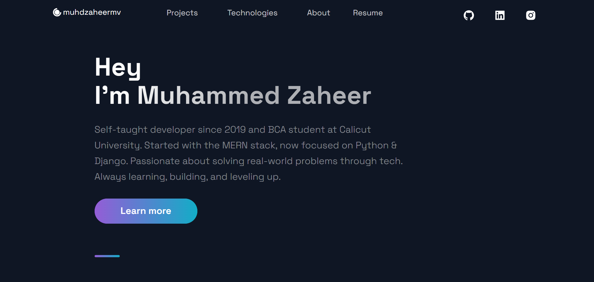

# 👨‍💻 Personal Portfolio using ReactJS

This is my **ReactJS-based personal portfolio website**, designed to showcase my work, skills, and contact information. It's fully responsive and built with reusable components, making it easy to scale and maintain as my portfolio grows.

## 🚀 Live Demo

👉 [Live App](https://portfolio-lilac-eight-60.vercel.app/)

## 🛠️ Tech Stack

- **ReactJS**
- **JavaScript (ES6+)**
- **CSS3 / Styled Components / Tailwind (if applicable)**

## ✨ Features

- Fully responsive across all devices
- Projects section with live links
- About Me & Skills section
- Resume & Contact section
- Smooth scroll and interactive UI
- Clean and modern UI design

## 📚 Ideal For

- Web Developer Portfolios
- ReactJS UI practice
- Showcasing Projects and Skills
- Personal Branding

## 📫 Contact Me

- **📧 Email:** muhdzaheermv@gmail.com  
- **🔗 Portfolio:** [https://portfolio-lilac-eight-60.vercel.app/](https://portfolio-lilac-eight-60.vercel.app/)  
- **💼 LinkedIn:** [https://www.linkedin.com/in/muhammed-zaheer-836132244/](https://www.linkedin.com/in/muhammed-zaheer-836132244/)

## ⭐ Like This Project?

If this portfolio inspired or helped you, feel free to **⭐ star** the repo — your support is appreciated and motivates me to create more!

